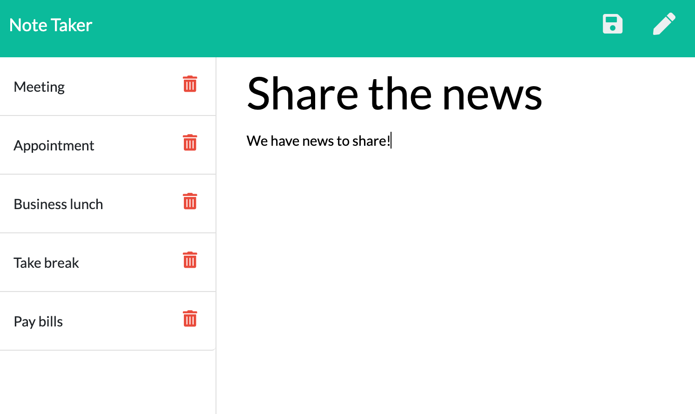

# Express.js -- NoteTaker

[](https://opensource.org/licenses/MIT)

## Description

NoteTaker is a command line application that displays on the web using node.js through web framework express.js. Combining front-end and back-end web development application to complete the assignment. Establishing API routes and HTML routes to communicate data between files and servers. Utilized GET, POST, DELETE, USE, and LISTEN to obtain information that is to be run on a server in localhost.

## Screenshots

<br>
<br>
<br>
<imr src="./assets/notes_look3.png" width="75%">

## Installation

```
Within the folder of the files you are working on..
 - Open Terminal

Making sure that you have a package.json set up...
 - npm install

Ensuring all node-modules are ready...
 - node server.js

Having started the server listening...
 - open web browser and type in http://localhost:3000

After home page shows..
 - click "Get Started" to view the notes

After entering a title and note text...
 - click on note icon to save note

Once note is saved on the left tab...
 - Choose to view note by clicking on note or delete note by clicking on trashbin icon

```

## Usage

* User can... 
    * make and save notes
    * enter a display where you are lead to see note (if any available)
    * add new ones to save into the column
    * delete current or saved notes
    * delete all notes available

## Attributes

<a href="" target="_blank">Node.js</a><br>
<a href="" target="_blank">Express.js</a>


## License

MIT License

## Links
<a href="https://notetakerbysey.herokuapp.com/" target="_blank"> Heroku deployed</a>


-----
© 2020 Seychelle Koplik